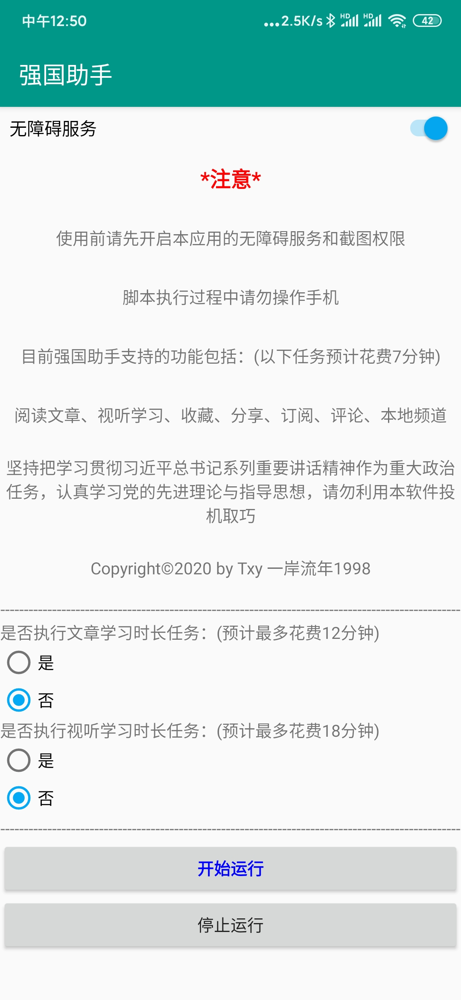
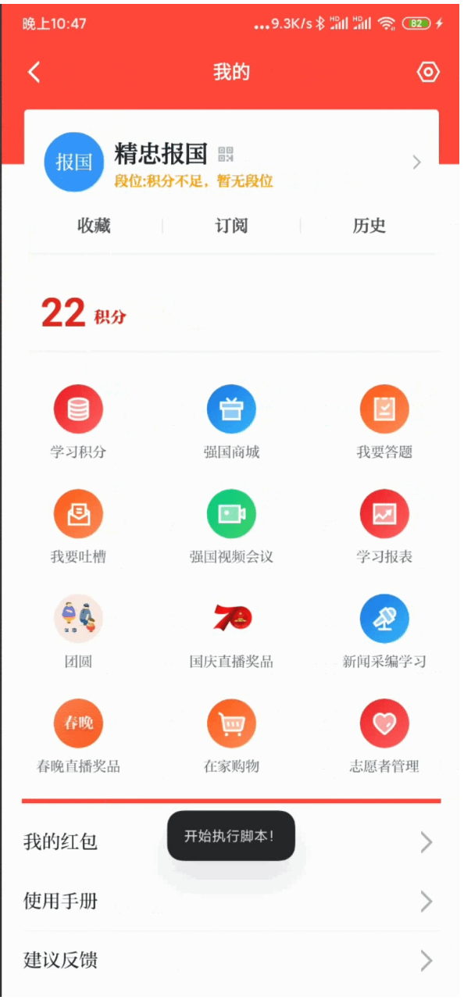
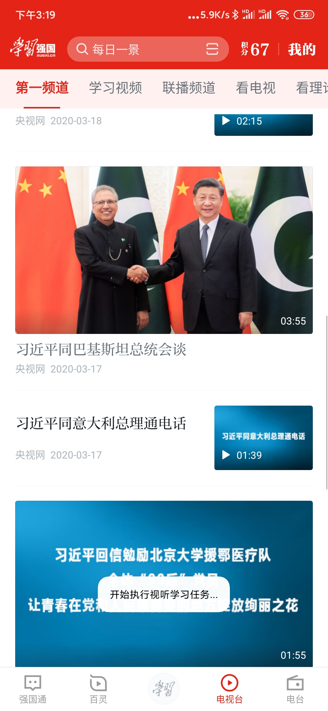

# 《强国助手》说明文档

## 一、文档介绍

本文档的目的是在经过《学习强国》安卓脚本的实战开发后，梳理个人在学习Auto.js过程中的知识点，并对每一个功能进行思路讲解和代码介绍，希望能通过本项目帮助学习Auto.js的人更进一步理解脚本开发步骤和原理。

如果对您有帮助，欢迎您star⭐一下小星星~

**仓库内容：**

Images文件夹——存放演示图片和视频

强国助手.apk —— 脚本打包后封装好的安卓软件应用安装包

学习强国.apk——学习强国v2.10.0版本（截至2020.3.21官方最新版）

Auto.js官方API文档——字面意思

AutoLearnChina.js —— 核心脚本执行文件

Readme.md —— 《强国助手》说明文档

**声明：**

1.本项目供程序员日常学习交流使用，**不得用于其他任何商业用途**。

2.apk软件是本人利用Auto.js打包插件完成的，不包含病毒可放心安装使用。

3.本项目不提倡每天利用脚本软件来刷《学习强国》积分。

4.希望大家正视脚本内容本身，坚持把学习贯彻习近平总书记系列重要讲话精神作为重大政治任务，认真学习党的先进理论与指导思想，**请勿利用本软件投机取巧**。

5.经过n个账号的两天测试，暂未发现封号风险，理论上Auto.js模仿人的思路对控件进行模拟点击，如果每天一直使用，不保证不会封号。

## 二、产品介绍

本项目是一款基于Auto.js工具开发的安卓脚本应用软件，依靠目前的脚本，最多每日能够获得32积分（除答题以外的所有分值）。

目前软件**实现的任务功能**包括了以下几点：

1.阅读文章

2.视听学习

3.收藏

4.分享

5.订阅

6.评论

7.本地频道

8.文章学习时长（可选）

9.视听学习时长（可选）

在当日未执行所有任务的情况下，脚本完成任务1-7预计花费7分钟。

脚本完成任务8预计花费12分钟。

脚本完成任务9预计花费18分钟。

**未实现的任务功能**包括：

1.每日答题

2.每周答题

3.专项答题

4.挑战答题


## 三、如何使用？

**版本要求：**

1.手机系统：仅支持安卓系统，最好是安卓7.0以上。

2.手机型号：

目前经过测试能正常运行的：

红米K20 Pro（安卓10）、华为nova5pro（安卓10）、华为荣耀20（安卓10）、华为P20 Pro（安卓10）其他机型未知。

其中解决华为手机不能显示脚本执行过程的通知办法：进入手机管家-病毒查杀-风险管控中心-对强国助手解除管控-再打开设置-通知-允许强国助手发送通知

未通过测试的：

oppo A59s（安卓5.1）

3.应用版本：《学习强国》v2.10.0

目前以上版本以通过测试，其他版本机型未知。

**使用手册**：

1.下载apk软件，安装；

2.关闭退出《学习强国》软件，打开《强国助手》软件；

3.需要打开《强国助手》的无障碍服务和截图功能，到时根据软件提示进行相应操作即可；

4.无需输入任何配置参数，选择是否执行可选任务后，一键运行。

5.在程序运行过程中将手机放到一旁即可，最好不要中途操纵手机，等待程序执行结束，即可查看获得积分或关闭《学习强国》。

**附：**

如果不小心中途操作手机导致脚本执行失败，重启脚本软件再执行即可。

通常情况下每5秒内会更新脚本执行消息并在屏幕下方显示通知信息，如果超过20秒学习强国页面未变化或者未出现通知，重启脚本软件再执行即可。

为防止阅读时长任务和视听时长任务为了一次性得到满积分而陷入长时间循环状态，故每次只执行固定阅读/观看次数。若发现执行结束后积分未满，重新执行脚本开启任务即可。

由于脚本并未做学习强国全版本测试，也没有钱做更多的机型适配测试，所以欢迎广大程序员来疯狂测试，程序也存在很多不足，欢迎大家批评指正！望共同进步！

**使用效果：**

1.软件主页：



2.使用过程静态展示：

<figure class="testphoto">
	<center>
	
	
	
    
	</center>
</figure>


3.使用过程动态展示：(可见Image文件夹中的视频文件)


## 四、如何进行迭代式增量开发？

### 1.了解什么是Auto.js

**Auto.js**是一个支持无障碍服务的Android平台上的JavaScript IDE，可以编写各种自动化脚本，它主要有以下优点：

1. 无需root：基于无障碍服务；
2. 基于控件：以坐标为基础的按键精灵、脚本精灵很容易出现分辨率问题，而以控件为基础的Auto.js则没有这个问题；
3. 上手简单：使用javascript编写，支持中文变量名；
4. 可打包 ：可以将JavaScript打包为apk文件，这一点可以简化用户操作，对上了年纪的用户很重要；

### 2.配置安装Auto.js和VScode、TotalControl等电脑调试及投屏软件

Auto.js下载与详细介绍：https://github.com/hyb1996/Auto.js/

项目开发的准备工作：https://www.bilibili.com/video/av93396608

Auto.js入门教程：https://space.bilibili.com/21486893

学完了以上3个链接，相信你一定对Auto.js开发有了比较全面基础的理解，在我看来，安卓脚本开发中最难的就是控件的寻找，如果找到了控件，接下来对控件的操作只要学会查API文档，就能应付开发中的大部分情况了。

### ３.打开本项目的AutoLearnChina.js 

在文件底部，你可看到未完成的方法体，它们就是答题模块，本人比较菜，对该部分模块开发还没有什么思路，也希望能得到高人指点，也可共同开发完成。

### ４.从App应用的一个页面开始，新建文件对该页面上需要完成的功能进行开发。

复制空方法体到一个新文件，或是新建一个函数体，在该新文件中对该方法要完成的功能进行开发，开发完成后复制到原文件中即可。


## 五、已完成功能的代码思路介绍

**教程：**

JS入门：https://www.bilibili.com/video/av35958121

控件寻找：https://www.bilibili.com/video/av36724143

控件操作：https://www.bilibili.com/video/av37314451

### 1.UI部分

套用模板即可，主要是需要对用户的输入进行传值，需要用户提前开启无障碍服务和截图权限。

```javascript
"ui";
var form = {
    isLongRead: false,
    isLongWatch: false
}
ui.layout(
    <vertical>
        <appbar>
            <toolbar title="强国助手"/>
        </appbar>
        <Switch id="autoService" text="无障碍服务" checked="{{auto.service != null}}" padding="8 8 8 8" textSize="15sp"/>
        <frame height="50" gravity="center">
            <text text="*注意*" gravity="center" textSize="18sp" textColor="red" textStyle="bold"/>
        </frame>
        <frame height="50" gravity="center">
            <text text="使用前请先开启本应用的无障碍服务和截图权限" gravity="center"/>
        </frame>
        <frame height="50" gravity="center">
            <text text="脚本执行过程中请勿操作手机" gravity="center"/>
        </frame>
        <frame height="50" gravity="center">
            <text text="目前强国助手支持的功能包括：(以下任务预计花费7分钟)" gravity="center"/>
        </frame>
        <frame height="50" gravity="center">
            <text text="阅读文章、视听学习、收藏、分享、订阅、评论、本地频道" gravity="center"/>
        </frame>
        <frame height="80" gravity="center">
            <text text="坚持把学习贯彻习近平总书记系列重要讲话精神作为重大政治任务，认真学习党的先进理论与指导思想，请勿利用本软件投机取巧" gravity="center"/>
        </frame>
        <frame height="50" gravity="center">
            <text text="Copyright©2020 by Txy 一岸流年1998" gravity="center"/>
        </frame>
        <frame height="20" gravity="center">
            <text text="---------------------------------------------------------------------------------------------------------------------------------" gravity="center"/>
        </frame>
        <vertical>
        <text text="是否执行文章学习时长任务：(预计最多花费12分钟)"/>
        <radiogroup id="long_read">
            <radio id="yes_read"  text="是"></radio>
            <radio  id="no_read" text="否" checked = "true"></radio>
        </radiogroup>
        </vertical>
        <vertical>
        <text text="是否执行视听学习时长任务：(预计最多花费18分钟)"/>
        <radiogroup id="long_watch">
            <radio id="yes_watch"  text="是"></radio>
            <radio  id="no_watch" text="否" checked = "true"></radio>
        </radiogroup>
        </vertical>
        <frame height="20" gravity="center">
            <text text="---------------------------------------------------------------------------------------------------------------------------------" gravity="center"/>
        </frame>
        <button id="start" text="开始运行" textColor="blue" textStyle="bold"/>
        <button id="stop" text="停止运行" />
    </vertical>
);

ui.yes_read.on("check",function(check){
    if(check){
        form.isLongRead= true;
    }
});
ui.no_read.on("check",function(check){
    if(check){
        form.isLongRead= false;
    }
});
ui.yes_watch.on("check",function(check){
    if(check){
        form.isLongWatch= true;
    }
});
ui.no_watch.on("check",function(check){
    if(check){
        form.isLongWatch= false;
    }
});
ui.autoService.on("check", function(checked) {
    // 用户勾选无障碍服务的选项时，跳转到页面让用户去开启
    if(checked && auto.service == null) {
        app.startActivity({
            action: "android.settings.ACCESSIBILITY_SETTINGS"
        });
    }
    if(!checked && auto.service != null){
        auto.service.disableSelf();
    }
});

// 当用户回到本界面时，resume事件会被触发
ui.emitter.on("resume", function() {
    // 此时根据无障碍服务的开启情况，同步开关的状态
    ui.autoService.checked = auto.service != null;
});

ui.start.on("click", function(){
    //程序开始运行之前判断无障碍服务
    if(auto.service == null) {
        toastLog("请先开启无障碍服务！");
        return;
    }

    main();
});

ui.stop.on("click",function(){
    threads.shutDownAll();
    engines.stopAll();
    exit();
    toast("已终止执行脚本");
});
```

### 2.Main方法（入口函数）

```javascript
function main() {

    // 这里写脚本的主逻辑
    threads.start(function () {
        if(!requestScreenCapture()){
            toastLog("请先开启截图权限，以执行收藏任务！");
            toastLog("运行结束,脚本自动退出...");
            exit();
        }
        toastLog("主程序开始运行");
        try {
            //检查无障碍服务是否已经启用,如果没启动,跳转到启动界面,启动后继续执行
            // auto.waitFor(); 
            launchApp("学习强国");
            waitForPackage("cn.xuexi.android");
            sleep(3000);
            toast("开始执行脚本！")
            getTaskList(); // 获取任务列表
            doUnfinishedTask(); //执行当日未完成的任务
            doExtraTask();
            back();//回到手机主页
            sleep(2000);
        } catch (error) {
            log(error)
            toast("出现异常,请关闭应用重新执行脚本！");
            exit(); // 有异常退出，结束脚本
        }
        toastLog("运行结束,脚本自动退出...");
        threads.shutDownAll();
        engines.stopAll();
        exit();
    });
}
```

### 3.getTaskList(); // 获取任务列表

主要得到当日还未达到满分的任务，将其存入taskInfoList数组。

```javascript
function getTaskList() {
    toastLog("执行获取任务列表")
    // 从主页到我的主页
    className("android.widget.TextView").id('comm_head_xuexi_mine').findOne().click();
    sleep(2000);
    // 点击事件在我的积分父控件上
    id("user_item_name").text("学习积分").findOne().parent().click()
    // waitForPackage("cn.xuexi.android")
    waitForActivity("com.alibaba.lightapp.runtime.activity.CommonWebViewActivity")
    sleep(3000);
    toastLog("获取任务列表...")
    // 获取任务列表
    taskInfoList = []; // 重置
    className("android.widget.ListView").findOne().children().forEach(function (child) {
        var list = child.find(className('android.view.View'));
        log(list)
        if (list.length > 5) {
            var title = list.get(2).contentDescription;
            var content = list.get(4).contentDescription;
            if (title && content) {
                var integralContent = content.split('/');
                var getIntegral = parseInt(integralContent[0].replace(/[^0-9]/ig, ""));
                var targetIntegral = parseInt(integralContent[1].replace(/[^0-9]/ig, ""));
                taskInfoList.push({
                    title: title,
                    getIntegral: getIntegral,
                    targetIntegral: targetIntegral,
                })
            }
        }
    });
    if (!taskInfoList.length) {
        toastLog('获取任务失败！请关闭应用并重启脚本...');
        threads.shutDownAll();
        engines.stopAll();
        exit(); // 有异常退出，结束脚本
    } else {
        toastLog("成功获取任务列表,退到首页");
        log(taskInfoList);
        back();//从“积分”页跳转到“我的”
        sleep(2000);
        back();//从“我的”跳转到“首页”
        sleep(2000);
    }
};
```

### 4.doUnfinishedTask(); //执行当日未完成的任务

这部分也相当于一个入口函数，遍历第2步得到的任务列表的数组，通过条件分支，逐个进入各个方法体完成任务。

```JavaScript
function doUnfinishedTask(){
    var flag = 0;//判断是否完成所有任务满分的标志
    var read_article_flag = 2 //判断阅读文章任务是否已完成，作为参数传入视听学习任务的new_vedio_list用于控件寻找
    for(i=0;i<taskInfoList.length;i++){
        var task = taskInfoList[i];
        // log(task);
        //如果当日获得积分<当日上限积分
        if(task.getIntegral < task.targetIntegral){
            flag = 1;
            // log('未达成满分的任务有：'+task.title)
            if(task.title=='阅读文章'){
                rest_num = task.targetIntegral-task.getIntegral;
                read_article_flag = 2;
                readArticle(rest_num,8,false);//默认阅读8s，执行短时阅读任务
                continue;
            }
            else if(task.title=='视听学习'){
                rest_num = task.targetIntegral-task.getIntegral;
                learnVideo(rest_num,read_article_flag,8,false);//默认观看8s,执行短时视听任务
                continue;
            }
            else if(task.title=='每日答题'){
                sleep(2000)
                toastLog('开始执行每日答题任务(暂未开发)')
                continue;
            }
            else if(task.title=='每周答题'){
                toastLog('开始执行每周答题任务(暂未开发)')
                sleep(2000)
                continue;
            }
            else if(task.title=='专项答题'){
                toastLog('开始执行专项答题任务(暂未开发)')
                sleep(2000)
                continue;
            }
            else if(task.title=='订阅'){
                rest_num = task.targetIntegral-task.getIntegral;
                subscribe(rest_num);
                continue;
            }
            else if(task.title=='分享'){
                share();
                continue;
            }
            else if(task.title=='收藏'){
                collect();
                continue;
            }
            else if(task.title=='发表观点'){
                comment();
                continue;
            }
            else if(task.title=='本地频道'){
                localChannel();
                continue;
            }
            
        }

    }
    if(!flag)
    {
        toastLog('已完成当日所有脚本任务！d=====(￣▽￣*)b')
    }
};
```

之后的部分则是实现各个功能的方法介绍。

### 5.阅读文章（时长）&视听学习（时长）

这两部分是我一开始开发的功能模块，因为视听学习和阅读文章的操作相似，而Auto.js也是模拟人的思路去点击控件。因为时长就是停留在文章页面的时间更久一点，因此把停留时间上升到方法的参数，在不同的应用场景中进行对应调整即可。

阅读文章模块：

第一个参数num是当前剩余阅读文章数（下同），第二个参数time则是在详情页的停留时间。

```javascript
function readArticle(num,time,isLong){
    sleep(1000);
    toastLog('开始执行阅读文章任务...')
    //点击要闻
    className("android.widget.TextView").text("要闻").findOne().parent().click();
    //先看右上角总积分，如果看完某文章，积分没变，说明该文章以前看过，不算有效文章，num不减
    var origin_score = id("comm_head_xuexi_score").findOne().getText();
    log("origin_score:"+origin_score)
    
    //阅读文章
    while(num>0){
        var newListView = className("android.widget.ListView").depth(20).findOnce(1);
        log('newListView:'+newListView)
        if(newListView!=null)
        {
            // log('newListView:'+newListView)
            var newslist = newListView.children();
            // log('list.length:'+newslist.length);
            if (newslist.length > 0) 
            {
                newslist.forEach(function(item,index){
                    if(index&&num>0){//index==0时是linearLayout控件，无法点击，也不是子项要闻
                        sleep(2000);
                        isClick = item.click()//进入新闻内容页
                        if(isClick)
                        {
                            num--;
                            toastLog("进行模拟阅读"+time+"s...剩余阅读篇数："+num);
                            // waitForPackage("cn.xuexi.android");
                            for(var t=1;t<=time;t++)
                            {
                                sleep(1000);
                                left_time = time-t;
                                if(left_time%5==0)
                                {
                                    toast("还剩"+left_time+"s阅读时间...");
                                }
                            }
                            back();
                            // className("android.widget.ImageView").depth(11).findOne().click();
                            sleep(2000);
                            //返回之后看积分是否变化，若未变化，num++
                            var new_score = id("comm_head_xuexi_score").findOne().getText();
                            if(new_score==origin_score)
                            {
                                if(isLong)//如果是阅读时长任务
                                {
                                    num++;
                                    toastLog("检测积分未发生变化...向下翻页并进行长时阅读");
                                    pn = random(3,8);
                                    for(var p=1;p<=pn;p++)//往下多滑动几次
                                    {
                                        newListView.scrollDown();
                                        sleep(1000);
                                    }
                                }
                                else
                                {
                                    num++;
                                    toastLog("检测积分未发生变化...向下翻页并重置剩余阅读篇数："+num);
                                }
                                newListView.scrollDown();
                            }
                            else
                            {
                                origin_score = new_score;
                            }
                        }
                    }
                });
                // break;
            }
            newListView.scrollDown();
        } 
    }
    toastLog('阅读文章任务执行结束！d==(￣▽￣*)b')
    //点击学习控件回到新闻首页
    id("home_bottom_tab_button_work").findOne().click();
    sleep(1000);
};
```

视听学习模块：

在此对方法中第二个参数进行详细解释，这是在我对控件的实际操作中发现的问题而不得已而为之的解决办法，如果我之前执行过阅读文章的方法，那么在视频列表页中的list控件会被覆盖，简单说，就是在执行阅读文章任务后会对控件位置造成一定改变，即：

className("android.widget.ListView").depth(20).findOnce(read_article_flag);

read_article_flag判断阅读文章任务是否已完成，作为参数传入视听学习任务的new_vedio_list用于控件寻找。

```javascript
function learnVideo(num,read_article_flag,time,isLong){
    log("read_article_flag:"+read_article_flag);
    sleep(1000);
    toastLog('开始执行视听学习任务...');
    //进入电视台频道
    desc("电视台").id("home_bottom_tab_button_contact").findOne().click();
    //先看右上角总积分，如果看完某视频，积分没变，说明该视频以前看过，不算有效视频，num不减
    var origin_score = id("comm_head_xuexi_score").findOne().getText();
    log("origin_score:"+origin_score)
    //进入第一频道
    className("android.widget.TextView").text("第一频道").findOne().parent().click();
    var new_vedio_list = className("android.widget.ListView").depth(20).findOnce(read_article_flag);
    while(num>0){
        new_vedio_list = className("android.widget.ListView").depth(20).findOnce(read_article_flag);
        log('new_vedio_list:'+new_vedio_list)
        if(new_vedio_list!=null)
        {
            var newslist = new_vedio_list.children();
            if (newslist.length > 0) 
            {
                newslist.forEach(function(item,index){
                    if(index&&num>0){//index==0时是linearLayout控件，无法点击，也不是子项要闻
                        sleep(2000);
                        isClick = item.click()//进入视频内容页
                        if(isClick)
                        {
                            num--;
                            toastLog("进行模拟观看"+time+"s...剩余视听："+num+"次");
                            for(var t=1;t<=time;t++)
                            {
                                sleep(1000);
                                left_time = time-t;
                                if(left_time%5==0)
                                {
                                    toast("还剩"+left_time+"s视听时间...");
                                }
                            }
                            //点击返回
                            // className("android.widget.ImageView").depth(13).findOne().click()
                            back();
                            sleep(2000);
                            //返回之后看积分是否变化，若未变化，num++
                            var new_score = id("comm_head_xuexi_score").findOne().getText();
                            if(new_score==origin_score)
                            {
                                if(isLong)//如果是视听时长任务
                                {
                                    num++;
                                    toastLog("检测积分未发生变化...向下翻页并继续进行长时视听");
                                    pn = random(3,8);
                                    log("pn:"+pn);
                                    for(var p=1;p<=pn;p++)//往下多滑动几次
                                    {
                                        new_vedio_list.scrollDown();
                                        sleep(1000);
                                    }
                                }
                                else
                                {
                                    num++;
                                    toastLog("检测积分未发生变化...向下翻页并重置剩余视听次数："+num);
                                }
                                new_vedio_list.scrollDown();
                            }
                            else
                            {
                                origin_score = new_score;
                            }
                        }
                    }
                });
                // break;
            }
        }
        else
        {
            if(read_article_flag==2)
            {
                read_article_flag = 1;
                new_vedio_list = className("android.widget.ListView").depth(20).findOnce(read_article_flag);
                log("read_article_flag = 1的new_vedio_list："+new_vedio_list)
            }
            else
            {
                read_article_flag = 2;
                new_vedio_list = className("android.widget.ListView").depth(20).findOnce(read_article_flag);
                log("read_article_flag = 2的new_vedio_list："+new_vedio_list)
            }
            new_vedio_list.scrollDown();
        } 
    }
    toastLog('视听学习任务执行结束！d==(￣▽￣*)b')
    //点击学习控件回到新闻首页
    id("home_bottom_tab_button_work").findOne().click();
    sleep(1000);
};
```

### 6. 分享、评论、本地频道模块

这部分内容比较简单，主要是在进入文章后，找到分享控件，然后按步骤点击分享-分享到学习强国-然后在这个页面停留一段时间返回即可，所以即使没有好友，也可以执行分享任务。

分享模块：

```javascript
function share(){
    toastLog('开始执行分享任务...');
    sleep(1000);
    //点击要闻
    className("android.widget.TextView").text("要闻").findOne().parent().click();
    //阅读文章
    var newListView = className("android.widget.ListView").depth(20).findOnce(1);
    if(newListView!=null)
    {
        var newslist = newListView.children();
        if (newslist.length > 0) 
        {
            newslist.forEach(function(item,index){
                if(index>0&&index<=2){//index==0时是linearLayout控件，无法点击，也不是子项要闻
                    sleep(2000);
                    isClick = item.click()//进入新闻内容页
                    if(isClick)
                    {
                        sleep(1000);
                        toastLog("正在分享该文章...");
                        //找到分享控件
                        var share_icon = className("android.widget.ImageView").depth(10).drawingOrder(4).findOne();
                        // log("share_icon:"+share_icon);
                        share_icon.click();
                        sleep(2000);
                        var share_choice = text("分享到学习强国").id("txt_gv_item").findOne().parent();
                        // log("share_choice:"+share_choice);
                        sleep(2000);
                        //点击分享
                        share_choice.click();
                        //停留5秒
                        sleep(5000);
                        //返回新闻主体内容界面    
                        back();
                        sleep(2000);
                        // 返回要闻主页
                        back();
                    }
                }
            });
        }
        newListView.scrollDown();
    } 
    toastLog('分享任务执行结束！d==(￣▽￣*)b')
    //点击学习控件回到新闻首页
    id("home_bottom_tab_button_work").findOne().click();
    sleep(1000);
};
```

评论模块同理，找到文本框控件，设置内容后找到发布控件点击即可，注意停留一段时间再返回，因为强国不允许马上二次评论。

评论模块：

```javascript
function comment(){
    toastLog('开始执行发表观点任务...');
    sleep(1000);
    //点击要闻
    className("android.widget.TextView").text("要闻").findOne().parent().click();
    //阅读文章
    var newListView = className("android.widget.ListView").depth(20).findOnce(1);
    if(newListView!=null)
    {
        var newslist = newListView.children();
        if (newslist.length > 0) 
        {
            newslist.forEach(function(item,index){
                if(index>0&&index<=2){//index==0时是linearLayout控件，无法点击，也不是子项要闻
                    sleep(2000);
                    isClick = item.click()//进入新闻内容页
                    if(isClick)
                    {
                        sleep(1000);
                        toastLog("正在发表观点...");
                        //找到Text文本框控件
                        var comment_icon = className("android.widget.TextView").text("欢迎发表你的观点").findOne();
                        // 点击发表观点
                        comment_icon.click();
                        sleep(2000);
                        //键入观点内容
                        className("android.widget.EditText").findOne().setText("中国加油！祝福祖国的未来更加繁荣昌盛！");
                        sleep(2000);
                        //点击发布
                        className("android.widget.TextView").text("发布").findOne().click();
                        toastLog("评论发布成功，等候10s回到主页...")
                        sleep(10000);
                        //回到新闻list页
                        back();
                    }
                }
            });
        }
        newListView.scrollDown();
    } 
    toastLog('发表观点任务执行结束！d==(￣▽￣*)b')
    //点击学习控件回到新闻首页
    id("home_bottom_tab_button_work").findOne().click();
    sleep(1000);
};
```

本地频道模块部分比较值得关注的地方则是导航栏中本地频道的控件获取，不能简单的通过text(“XXX”)方式，因为不同用户所在的地区是不一样的。所以这个控件的定位思路是先找到父控件，在利用Auto.js的布局层次分析，找到本地频道在父控件的第几个偏移处，这样就能确定下来了。

本地频道模块代码如下：

```javaScript
function localChannel(){
    toastLog('开始执行本地频道任务');
    sleep(1000);
    //找到推荐、要闻、本地频道等的父控件
    avv = className("android.view.ViewGroup").depth(14).findOnce(2);
    // log(avv)
    var address = ""
    avv.children().forEach(function(item,index){
        // log(item);
        if(index==3){//找到本地频道的入口控件，并点击
            address = item.child(0).getText();
            log(address);
            item.click();
        }
    });
    //找到第一个本地频道入口
    channel = className("android.widget.TextView").depth(26).textContains(address).findOne().parent();
    // log(channel)
    //点击进入
    channel.click();
    sleep(5000);
    back();
    sleep(2000);
    toastLog('本地频道任务执行结束！d==(￣▽￣*)b')
    //点击学习控件回到新闻首页
    id("home_bottom_tab_button_work").findOne().click();
    sleep(1000);
};
```

### 7.订阅模块

这个部分算比较难的部分，卡了我比较久的时间，从我的主页进入到订阅部分比较简单，找到控件点击即可，但在添加时，未订阅的“+”和已订阅的“√”控件属性完全相同，父子控件也完全相同（除了父控件的行数差异信息，但对找到订阅控件无帮助）。这时就无法区分两个控件，导致不知道哪一个公众号是否已订阅。

现在已经实现的思路是：首先在我的订阅中遍历所有已经订阅的账号名，将其放入数组。遍历完毕，进入添加页面，从头遍历，如果账号名不存在数组中，说明是新账号，则进行订阅的点击操作。

还有一个注意点是，如果一开始用户没有订阅任何的订阅号，将会出现一个特殊的控件，需要注意区分。

目前该模块仅能订阅强国号的内容，如果强国号栏订阅完了就没有可以订阅的了，以后可针对这部分对该模块进行改进。

代码如下：

```javascript
function subscribe(num){
    sleep(1000);
    toastLog('开始执行订阅任务');
    // 从主页到我的主页
    id("comm_head_xuexi_mine").text("我的").findOne().click();
    sleep(2000);
    //点击订阅控件
    id("my_subscribe_tv").text("订阅").findOne().click();
    // waitForActivity("android.widget.FrameLayout",200);
    // log('过来了');
    sleep(3000);
    
    //在我的订阅里面找到所有订阅号，存起来
    var subscribed_accounts = [];

    //如果没有订阅任何订阅号，那直接点击添加
    if(id("no_content_text").exists()){
        //点击添加
        className("android.widget.TextView").text("添加").findOne().click();
        //在添加里面逐一扫描每个订阅号是否在上面的已订阅中，如果没匹配到，则订阅这个公众号,订阅num个即可
        accounts_pool = className("android.widget.ListView").depth(13).findOne();
        var bottom_flag = 0;
        while(accounts_pool!=null&&num>0)
        {
            sleep(1000);
            var frameLayoutList = accounts_pool.children();
            frameLayoutList.forEach(function(item,index){
                if(item.className()=='android.widget.FrameLayout')
                {
                    var account_name = item.find(className("android.widget.TextView"));
                    if(num>0&&subscribed_accounts.indexOf(account_name[0].text())==-1)//说明数组中不存在这个元素,则订阅他
                    {
                        num--;
                        subscribed_accounts.push(account_name[0].text());
                        subscribe_icon = item.find(className("android.widget.LinearLayout"))[1];
                        // log("subscribe_icon:"+subscribe_icon)
                        toastLog("正在订阅...");
                        subscribe_icon.click();
                        sleep(2000);
                    }
                    else if(item.className()=='android.widget.LinearLayout')//遍历到底了
                    {
                        bottom_flag = 1;
                        return;
                    }
                }
            });
            if(bottom_flag)
            {
                toastLog("强国号都已经订阅完啦...");
                break;
            }
            accounts_pool.scrollDown();
            sleep(2000);
            accounts_pool = className("android.widget.ListView").depth(13).findOne();
        }
    
    }
    else//如果曾经订阅过，那么需要先找到订阅了哪些
    {
        var list_view = className("android.widget.ListView").depth(11).findOne();
        // log(list_view)
        var bottom_flag = 0;
        while(list_view!=null)
        {
            sleep(1000);
            var frameLayoutList = list_view.children();
            // log('frameLayoutList:'+frameLayoutList)
            frameLayoutList.forEach(function(item,index){
                if(item.className()=='android.widget.FrameLayout')
                {
                    // log(item)
                    var account_name = item.find(className("android.widget.TextView"));
                    // log('已订阅：'+account_name[0].text())
                    if(subscribed_accounts.indexOf(account_name[0].text())==-1)//说明数组中不存在这个元素
                    {
                        subscribed_accounts.push(account_name[0].text());
                    }
                }
                else if(item.className()=='android.widget.LinearLayout')//遍历到底了
                {
                    bottom_flag = 1;
                    return;
                }
            });
            if(bottom_flag)
            {
                break;
            }
            list_view.scrollDown();
            sleep(2000);
            list_view = className("android.widget.ListView").depth(11).findOne();
        }
        log(subscribed_accounts)

        //点击添加
        className("android.widget.TextView").text("添加").findOne().click();
        //在添加里面逐一扫描每个订阅号是否在上面的已订阅中，如果没匹配到，则订阅这个公众号,订阅num个即可
        accounts_pool = className("android.widget.ListView").depth(13).findOne();
        var bottom_flag = 0;
        while(accounts_pool!=null&&num>0)
        {
            sleep(1000);
            var frameLayoutList = accounts_pool.children();
            frameLayoutList.forEach(function(item,index){
                if(item.className()=='android.widget.FrameLayout')
                {
                    var account_name = item.find(className("android.widget.TextView"));
                    if(num>0&&subscribed_accounts.indexOf(account_name[0].text())==-1)//说明数组中不存在这个元素,则订阅他
                    {
                        num--;
                        subscribed_accounts.push(account_name[0].text());
                        subscribe_icon = item.find(className("android.widget.LinearLayout"))[1];
                        // log("subscribe_icon:"+subscribe_icon)
                        toastLog("正在订阅...");
                        subscribe_icon.click();
                        sleep(2000);
                    }
                    else if(item.className()=='android.widget.LinearLayout')//遍历到底了
                    {
                        bottom_flag = 1;
                        return;
                    }
                }
            });
            if(bottom_flag)
            {
                toastLog("强国号都已经订阅完啦...");
                break;
            }
            accounts_pool.scrollDown();
            sleep(2000);
            accounts_pool = className("android.widget.ListView").depth(13).findOne();
        }
    }
    toastLog("订阅任务执行结束！d==(￣▽￣*)b");
    back();//回到 我的订阅
    sleep(1000);
    back();//回到 我的
    sleep(1000);
    back();//回到学习首页
    sleep(1000);
};
```

### 8.收藏模块

这部分模块虽然和评论、分享处于同一个详情页面的位置，但是思路和评论分享不同，因为我进入一个页面需要先判断这篇文章是否已经被收藏，而对同意文章进行反复评论分享也能得到积分。所以需要特别注意。

截图功能就是在这里用上的，我需要通过图片来得到收藏小星星控件的中心像素，通过颜色的不同来比较是否收藏过，有人可能会想，订阅部分是否也可以通过图片颜色不同的方式（已订阅是灰色的“√”，未订阅是红色的"+"）来区分。事实上会比较麻烦，因为在收藏模块中，其控件在页面的位置是固定的，但是订阅部分是可滑动的。

```javascript
function collect(){
    toastLog('开始执行收藏任务');
    sleep(1000);
    //点击要闻
    className("android.widget.TextView").text("要闻").findOne().parent().click();
    sleep(1000);
    //阅读文章
    var newListView = className("android.widget.ListView").depth(20).findOnce(1);
    // log('newListView:'+newListView)
    var num = 2;//待收藏文章数
    while(newListView!=null&&num>0)
    {
        // log('newListView:'+newListView)
        var newslist = newListView.children();
        // log('list.length:'+newslist.length);
        if (newslist.length > 0) 
        {
            newslist.forEach(function(item,index){
                if(index>0&&num>0){//index==0时是linearLayout控件，无法点击，也不是子项要闻
                    sleep(2000);
                    isClick = item.click()//进入新闻内容页
                    if(isClick)
                    {
                        toastLog("检测该文章是否收藏...");
                        sleep(2000);
                        //找到小星星控件
                        collect_star = className("android.widget.ImageView").depth(10).findOne();
                        log("collect_star:"+collect_star);
                        //检测小星星是否点亮
                        //截图取小星星控件的坐标范围
                        var img = captureScreen();
                        var star_bounds = collect_star.bounds();
                        //获取小星星中心的x,y坐标像素
                        var star_x = star_bounds.centerX();
                        var star_y = star_bounds.centerY();
                        // 小星星的中心RGB(255,196,61)
                        var collected_color = colors.rgb(255, 196, 61)
                        var color = images.pixel(img, star_x, star_y);
                        //如果颜色不匹配，说明未收藏
                        if(!colors.isSimilar(color,collected_color))
                        {
                            //收藏
                            toastLog("收藏该文章...");
                            sleep(1000);
                            collect_star.click();
                            num--;
                            sleep(1000);
                        }
                        //返回
                        back();
                        sleep(2000);
                    }
                }
            });
        }
        newListView.scrollDown();
        sleep(2000);
        newListView = className("android.widget.ListView").depth(20).findOnce(1);
    } 
    toastLog('收藏任务执行结束！d==(￣▽￣*)b')
    //点击学习控件回到新闻首页
    id("home_bottom_tab_button_work").findOne().click();
    sleep(1000);
};
```

